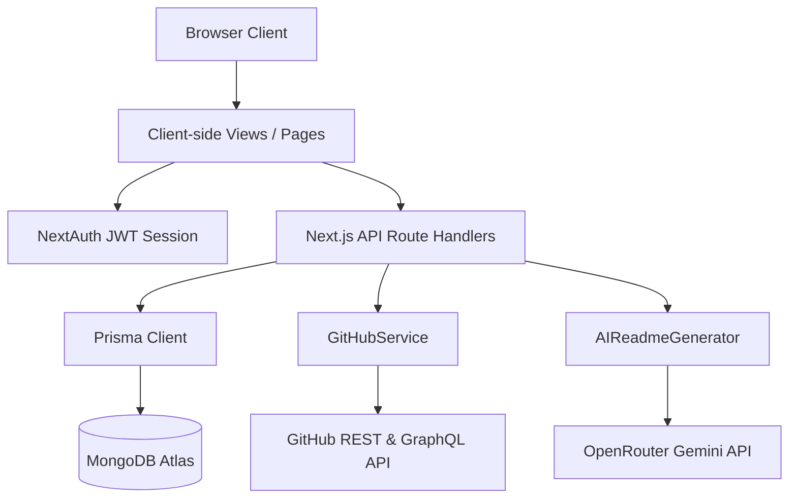

# Architecture Review

This document evaluates the architectural design, directory structure, data flow patterns, server/client boundaries, and maintainability of the **FlareGit** project.

---

## 1. Architectural Summary

FlareGit is architected as a full-stack Next.js 14 App Router application deployed as a monolith.



### Key Layers
* **Client / UI Layer (`src/app` & `src/components`)**: Uses React Client Components (`"use client"`) utilizing local React state to manage user actions.
* **Authentication Layer (`next-auth`)**: Integrates GitHub OAuth. NextAuth is configured to use a JWT strategy and manages user credentials and GitHub tokens.
* **Serverless API Layer (`src/app/api`)**: Exposes API endpoints that perform operations after verifying the NextAuth session.
* **Service Layer (`src/lib`)**: Abstracts external API calls. `GitHubService` handles communication with GitHub, `GitHubProfileAnalyzer` computes metrics, and `AIReadmeGenerator` handles prompt orchestration.
* **ORM & Database Layer (`prisma`)**: Connects to MongoDB Atlas using the Prisma client.

---

## 2. Server/Client Boundaries

### Strengths
* Standard Next.js server-client boundary setup is respected. Heavy services (like `Octokit` queries and OpenRouter fetching) are kept strictly on the server-side inside Route Handlers (`src/app/api/...`) and classes in `src/lib`.
* UI components only run lightweight fetch commands, keeping page loads responsive.

### Weaknesses & Risks
* **OAuth Access Token Leakage**: The GitHub OAuth access token (which contains write `repo` scopes to all repositories) is saved directly inside the NextAuth session object:
  ```javascript
  async session({ session, token }) {
    if (session.user) {
      session.accessToken = token.accessToken;
    }
    return session;
  }
  ```
  This serializes the raw OAuth token and exposes it to the browser client via the `useSession` hook and `/api/auth/session` endpoint. If the site is compromised via XSS or a third-party node dependency, attackers can steal this token to write to or delete user repositories.
* **Lack of Routing Middleware**: Route protection is handled in client-side components using `useEffect` redirects. This causes the browser to fetch and render dashboard outlines/skeletons before executing the redirect, leaking UI layout details and creating a flickering effect.

---

## 3. API Design & Security Check

### Strengths
* API endpoints are organized clean and logically under RESTful subfolders:
  * `/api/profile/[userId]` handles user metadata.
  * `/api/github/...` proxies telemetry requests.
  * `/api/ai/...` handles readme compilation.

### Weaknesses & Architectural Flaws
* **Broken Session Callback in Proxy APIs**: Multiple API endpoints (contributions, languages, stats, traffic, trends) call `getServerSession()` without passing the `authOptions` object. This results in the custom `accessToken` callback being ignored, causing the session to return `null` or undefined access tokens, throwing a `401 Unauthorized` on those views.
* **Missing Repository Ownership Checks**: The `update-readme` endpoint commits a README back to a repository owner's GitHub profile using the parameters `/api/github/repositories/[username]/[repo]/update-readme`. The endpoint retrieves the token from the logged-in session, but never verifies if `session.user.username === username`. An attacker could call the endpoint with another user's username parameter, which could push contents if credentials overlap or leak telemetry.
* **Custom URL Validation Absence**: The profile update endpoint accepts arbitrary strings for `customUrl` without filtering or parsing. This allows invalid characters (spaces, special symbols) to be stored in the database, breaking dynamic portfolio page lookup routing.

---

## 4. Data Flow Review

* Data queries from pages rely on native `fetch` requests triggered inside `useEffect` hooks. While functional, it lacks advanced caching, deduplication, and loading/retry state management. Although `@tanstack/react-query` is listed in `package.json`, it is not utilized anywhere in the application.
* Pinned project details and color customization schemas are stored as JSON blobs on the Prisma `Profile` document. This is a lightweight approach well-suited for MongoDB's document-store architecture, avoiding unnecessary table relations.

---

## 5. Architectural Quality Score

**Score: 6 / 10 (Needs Refactoring)**
While the service abstractions and folder separations are neat and structured, the raw token exposure, broken session handlers on 5 endpoints, missing database unique collision protection, and client-side page protection are significant architectural gaps that block a production release.

---

## 6. Refactor Recommendations

1. **Secure Session Tokens**: Store the GitHub access token inside the database (in the `Account` model) rather than serializing it into the client-side JWT session token. When API routes need to query GitHub, load the access token directly from the database using Prisma:
   ```javascript
   const account = await prisma.account.findFirst({ where: { userId: session.user.id, provider: 'github' } });
   const accessToken = account.access_token;
   ```
2. **Implement `middleware.js`**: Add a server-side routing middleware in `src/middleware.js` to protect dashboard endpoints:
   ```javascript
   import { withAuth } from "next-auth/middleware";
   export default withAuth({
     pages: { signIn: "/auth/signin" }
   });
   export const config = { matcher: ["/dashboard/:path*"] };
   ```
3. **Fix API Route Session Initializers**: Update all endpoints calling `getServerSession()` to pass `authOptions`:
   ```javascript
   import { authOptions } from "@/lib/auth";
   const session = await getServerSession(authOptions);
   ```
4. **Enforce Input Slug Validation**: Implement a server-side regex validation check on custom URLs:
   ```javascript
   const slugRegex = /^[a-zA-Z0-9-_]+$/;
   if (!slugRegex.test(data.customUrl)) {
     return new NextResponse(JSON.stringify({ error: "Invalid URL slug format" }), { status: 400 });
   }
   ```
5. **Deduplicate Hooks Code**: Delete `src/components/ui/use-toast.js` and keep `src/hooks/use-toast.js` to standardize toast messages.
