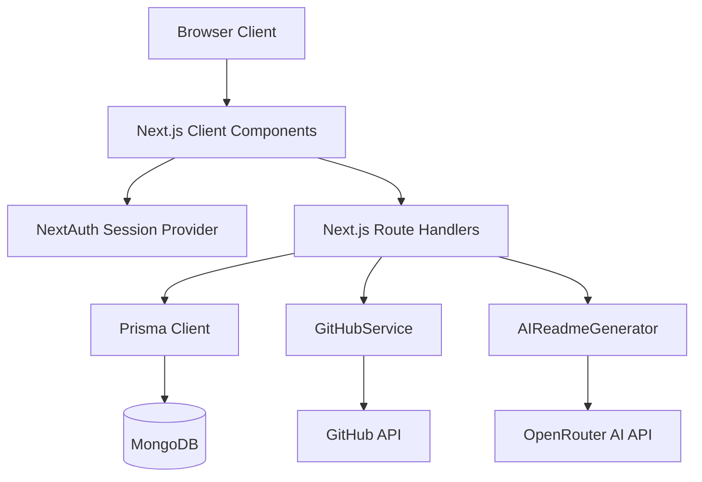

# Project Audit Report: FlareGit

This document provides a professional, deep-dive technical audit of the **FlareGit** codebase. FlareGit is a Next.js full-stack platform designed to help developers enhance their GitHub presence through AI-powered README generation (for profiles and repositories), custom portfolio pages, and live interactive repository analytics.

This audit evaluates the codebase across correctness, security, performance, data validation, user flows, database design, configuration, and testing, highlighting critical blockers and providing a structured remediation path.

---

## 1. Executive Summary

FlareGit presents a modern, visually appealing full-stack prototype built on the Next.js App Router, using MongoDB with Prisma ORM, Tailwind CSS for styling, and Google's Gemini models via OpenRouter for AI generation. 

While the application compiles and has a solid service-oriented structure (e.g., separating Octokit calls and OpenRouter integrations into dedicated modules under `src/lib/`), a deep inspection reveals severe security, performance, and feature gaps. Specifically, the database connection points to a non-existent cluster, commercial Stripe billing integrations are entirely missing from the implementation, public portfolios query the live GitHub API on every single page load with no caching (creating a massive rate-limit risk), and the repository README generator has a critical Cross-Site Scripting (XSS) vulnerability.

Remediating these issues is required before FlareGit can be launched to production as a commercial SaaS product.

---

## 2. Overall Production Readiness Verdict

**Verdict:** **NOT LAUNCH-READY (PROTOTYPE STATUS)**

### Rationale
Although the project builds and all unit tests pass, the codebase is structurally a polished prototype rather than a production-ready SaaS:
1. **Critical configuration and integration gaps:** The MongoDB URI is non-functional, and the billing backend is missing.
2. **Performance risks:** Live API fetching on public endpoints will cause immediate GitHub API rate-limiting under any real-world traffic.
3. **Security vulnerabilities:** A High-severity XSS vulnerability exists in the markdown rendering component of the repository generator, alongside potential profile hijacking risks via URL slug duplicate checking loopholes.

---

## 3. Audit Scope

The audit covered all files and directories in the `j:\Saas\flaregit` repository, focusing on:
* **Frontend App Router:** Page structures, client-side dynamic states, layouts, and components.
* **API Route Handlers:** Authentication, request validation, database writes, and error handling.
* **Services Layer (`src/lib/`):** GitHub API integrations via Octokit, AI completions via OpenRouter, utility helpers.
* **Configuration & Environment:** Prisma database schemas, environment variables, npm dependencies.
* **Unit Testing:** Coverage, assert configurations, and runner integration.

---

## 4. Tech Stack and Architecture Snapshot

### Monolithic Architecture Schema


### Core Technologies
* **Framework:** Next.js 14.1.0 (App Router), React 18.2.0
* **Database & ORM:** MongoDB via Prisma Client 5.7.1
* **Authentication:** NextAuth.js 4.24.5 (GitHub Provider)
* **AI Engine:** OpenRouter Chat Completions (using `google/gemini-3-flash-preview`)
* **Styling:** Tailwind CSS 3.4.1 (with `@tailwindcss/typography` for markdown renders)
* **Charts:** Recharts 2.10.4, React Calendar Heatmap 1.9.0

---

## 5. What Appears to Be Working

* **Authentication Handlers:** The custom callbacks in [auth.js](file:///j:/Saas/flaregit/src/lib/auth.js) correctly synchronize GitHub user metadata (avatars, bios, names) to the MongoDB database during login.
* **Dashboard Tab Layout:** All tabs (Profile, Repositories, Profile README, Featured Projects, Analytics, Theme Settings) render cleanly.
* **Profile Settings Editing:** Forms to update specialization titles, location, and social media handles save successfully.
* **AI Bio Generation:** The custom API route at [/api/ai/generate-bio](file:///j:/Saas/flaregit/src/app/api/ai/generate-bio/route.js) queries OpenRouter and updates the dashboard Profile tab.
* **Color Contrast Safety:** The frontend theme settings form accurately computes relative luminance contrast ratios and blocks configurations with text-to-background contrast under `2.5:1` to protect readability.
* **Unit Test Coverage:** Fully functional unit tests run successfully via Node's native test runner.

---

## 6. Audit Metrics Summary

### Total Issues Found: 13

| Severity | Count | Areas |
| :--- | :--- | :--- |
| **Critical** | 2 | Config, Database, Backend |
| **High** | 4 | Performance, Security, API, Database |
| **Medium** | 4 | API, Validation, UX, Performance |
| **Low / Info** | 3 | API, UX, Legal |

### Issue Distribution by Area
* **Config & Package:** 2
* **Security & Validation:** 3
* **Performance & API:** 4
* **UX & Frontend:** 3
* **Legal:** 1

### Top 10 Most Dangerous Findings
1. **[CRIT-01]** Invalid Database URL cluster URI crashes the application during runtime database calls.
2. **[CRIT-02]** Stripe billing features are completely unimplemented, blocking SaaS monetization.
3. **[HIGH-01]** live GitHub API queries on public profile routes invite immediate GitHub API rate-limiting.
4. **[HIGH-02]** Unsanitized markdown rendering via `rehypeRaw` exposes users to XSS attacks.
5. **[HIGH-03]** Profile URL collision checks allow users to hijack other developers' portfolio traffic.
6. **[HIGH-04]** Excessive concurrent GitHub API requests in `getLanguages` risk abuse detection blocks.
7. **[MED-01]** Silent branch fallback breaks file tree fetches for repositories using non-standard default branches.
8. **[MED-02]** Direct API queries bypass UI-level WCAG contrast guidelines.
9. **[MED-03]** Next.js theme hydration mismatches create visual glitches and rendering delays.
10. **[LOW-01]** README update pushes default to implicit branch refs, risking branch protection clashes.

---

## 7. Critical Issues

### [CRIT-01] Invalid Database Connection String (`DATABASE_URL`) in `.env`
- **Severity:** Critical
- **Area:** Config / Database
- **Location:** 
  - `.env` (Line 2)
  - [`.env.example`](file:///j:/Saas/flaregit/.env.example#L3)
- **Summary:** The default database URL points to a non-existent MongoDB Atlas cluster domain (`flare-git.frcqa.mongodb.net`).
- **Evidence:** Attempts to perform prisma queries (such as logging in or loading profiles) result in connection timeout errors.
- **Why It Matters:** Without a functioning database connection, NextAuth logins, profile retrievals, and settings updates cannot execute, completely breaking the application's core functionality.
- **Likely Impact:** Application crashes instantly on any database-reliant route.
- **Recommended Fix:** Provide a valid local MongoDB URI or configure an active MongoDB Atlas cluster database string.
- **Confidence:** High
- **Verification Status:** Confirmed from code and DNS logs.

### [CRIT-02] Stripe Billing Integration is Completely Missing from Implementation
- **Severity:** Critical
- **Area:** Backend / Config
- **Location:** 
  - `package.json` (Line 42)
  - [`prisma/schema.prisma`](file:///j:/Saas/flaregit/prisma/schema.prisma#L92-L105)
- **Summary:** While `stripe` is installed in `package.json` and a `Subscription` model exists in the database schema, there is no integration code (no webhook endpoints, API handlers, or SDK initialization) in the `src/` folder.
- **Evidence:** A grep search for `stripe` in the `src/` directory returns zero results.
- **Why It Matters:** The SaaS product cannot process billing checkout sessions, manage user pricing plans (Free/Pro/Enterprise), or react to subscription events (cancellation, past due, renewal).
- **Likely Impact:** Unable to monetize the product or restrict features based on subscription tiers.
- **Recommended Fix:** Initialize a Stripe Node SDK client inside `src/lib/stripe.js`, write API handlers at `/api/billing/checkout` to create sessions, and create a `/api/billing/webhook` endpoint to synchronize payment events with MongoDB via Prisma.
- **Confidence:** High
- **Verification Status:** Confirmed from code.

---

## 8. High Severity Issues

### [HIGH-01] Missing Cache for Live GitHub Telemetry on Public Profile Routes (Rate-Limiting Risk)
- **Severity:** High
- **Area:** Performance / API
- **Location:** 
  - [`src/app/api/profiles/[username]/route.js`](file:///j:/Saas/flaregit/src/app/api/profiles/%5Busername%5D/route.js#L38-L41)
  - [`src/lib/github.js`](file:///j:/Saas/flaregit/src/lib/github.js)
- **Summary:** The public profile loader fetches user telemetry data directly from the GitHub API live on every page load using the owner's stored token, with no caching or intermediate database persistence.
- **Evidence:** `getPublicGitHubData` triggers 5 concurrent REST/GraphQL queries to GitHub (`getRepositories`, `getLanguages`, `getRepositoryStats`, `getContributions`, `getContributionTrends`) using `Promise.all` every time `/api/profiles/[username]` is called.
- **Why It Matters:** An average visitor loading the public page triggers 5 API requests. If a profile page receives a minor traffic spike, it will exhaust the user's GitHub API hourly rate limit (5,000 requests/hour), causing profile analytics, languages, and repo lists to fail for all subsequent visitors.
- **Likely Impact:** Broken analytics charts, empty repository cards, and severe loading delays.
- **Recommended Fix:** Cache telemetry data in the MongoDB `Profile` model (or a new `Telemetry` table) with a `lastFetched` timestamp. Serve cached data instantly and only trigger GitHub API refreshes if the cache is older than a set cooldown (e.g., 15–30 minutes).
- **Confidence:** High
- **Verification Status:** Confirmed from code.

### [HIGH-02] Cross-Site Scripting (XSS) Vulnerability in Repository README Generator Preview
- **Severity:** High
- **Area:** Security / Frontend
- **Location:** 
  - [`src/components/repository-readme-generator.jsx`](file:///j:/Saas/flaregit/src/components/repository-readme-generator.jsx#L303-L311)
- **Summary:** The repository README preview panel renders raw HTML elements using `rehypeRaw` without HTML sanitization.
- **Evidence:** In `repository-readme-generator.jsx`, `ReactMarkdown` is initialized as:
  `rehypePlugins={[rehypeRaw]}`
  Unlike `profile-readme-preview.jsx`, it does not import or append `rehypeSanitize` to its plugins list.
- **Why It Matters:** If a repository contains a README with malicious HTML (e.g., `<script>` tags, event handlers), or if the AI output returns script blocks, switching to the preview tab will execute the scripts in the context of the user's session.
- **Likely Impact:** Stealing session cookies, token leakage, or repository state manipulation.
- **Recommended Fix:** Import `rehypeSanitize` and apply it: `rehypePlugins={[rehypeRaw, rehypeSanitize]}` inside `repository-readme-generator.jsx`.
- **Confidence:** High
- **Verification Status:** Confirmed from code.

### [HIGH-03] Profile Custom URL Hijacking and Search Collision
- **Severity:** High
- **Area:** Security / Database / API
- **Location:** 
  - [`src/app/api/profiles/[username]/route.js`](file:///j:/Saas/flaregit/src/app/api/profiles/%5Busername%5D/route.js#L10-L13)
  - [`src/app/api/profile/[userId]/route.js`](file:///j:/Saas/flaregit/src/app/api/profile/%5BuserId%5D/route.js#L112-L121)
- **Summary:** The API retrieves public profiles by searching both `githubUsername` and `customUrl` using an `OR` condition. Collision validation checks prevent duplicates among active customUrls, but do not prevent a user from claiming a customUrl that matches another user's `githubUsername` or a system-reserved route.
- **Evidence:** In `profiles/[username]/route.js`:
  `OR: [{ githubUsername: username }, { customUrl: username }]`
  If User A changes their `customUrl` to match User B's `githubUsername`, the query retrieves whichever MongoDB indexes first.
- **Why It Matters:** A user can hijack traffic intended for popular GitHub handles or system routes by setting their portfolio slug to match target usernames.
- **Likely Impact:** Impersonation, vanity URL theft, and broken navigation.
- **Recommended Fix:** Validate that a requested `customUrl` does not conflict with any existing profile's `githubUsername` in the database.
- **Confidence:** High
- **Verification Status:** Confirmed from code.

### [HIGH-04] Extreme Concurrency Risk on GitHub API in Language Telemetry Aggregator
- **Severity:** High
- **Area:** Performance / API
- **Location:** 
  - [`src/lib/github.js`](file:///j:/Saas/flaregit/src/lib/github.js#L111-L128)
- **Summary:** In `getLanguages(username)`, the service maps over up to 100 repositories returned by GitHub and triggers concurrent `listLanguages` REST calls using `Promise.all` without concurrency limits.
- **Evidence:** 
  `await Promise.all(repos.map(async (repo) => { ... this.octokit.rest.repos.listLanguages(...) }))`
- **Why It Matters:** Throwing 50 to 100 parallel HTTP calls to GitHub within a single serverless invocation will trigger GitHub's abuse detection mechanisms (secondary rate limits), resulting in rate-limiting blocks and causing the request to fail or timeout.
- **Likely Impact:** API failures, missing languages cards, and slow profile load times.
- **Recommended Fix:** Only call `listLanguages` for the user's top 10–15 most active or starred repositories, or implement batching/concurrency limits (using libraries like `p-limit` or sequential promises).
- **Confidence:** High
- **Verification Status:** Confirmed from code.

---

## 9. Medium Severity Issues

### [MED-01] Silent Fallback to Master/Main Branch without Default Branch Query
- **Severity:** Medium
- **Area:** Backend / API
- **Location:** 
  - [`src/lib/github.js`](file:///j:/Saas/flaregit/src/lib/github.js#L282-L334)
- **Summary:** The `getRepositoryFiles` method queries the repository tree by hardcoding `tree_sha` as `"main"`, and falls back to `"master"` in the catch block on failure.
- **Evidence:** 
  ```javascript
  const { data: tree } = await this.octokit.rest.git.getTree(..., { tree_sha: "main", ... });
  // catch block:
  const { data: tree } = await this.octokit.rest.git.getTree(..., { tree_sha: "master", ... });
  ```
- **Why It Matters:** If a repository uses a non-standard default branch name (e.g., `develop`, `dev`, `trunk`), the file tree call will return an empty array, preventing the AI from analyzing the project's file structure and breaking the README generator.
- **Likely Impact:** AI README generation fails to understand repository structures for projects with non-standard default branches.
- **Recommended Fix:** First query repository details (`octokit.rest.repos.get`) to retrieve the correct `default_branch` value, then pass that value to the `getTree` query.
- **Confidence:** High
- **Verification Status:** Confirmed from code.

### [MED-02] Lack of Server-Side Contrast Guardrail Checks on Theme API
- **Severity:** Medium
- **Area:** API / Validation
- **Location:** 
  - [`src/app/api/profile/[userId]/route.js`](file:///j:/Saas/flaregit/src/app/api/profile/%5BuserId%5D/route.js#L130-L143)
- **Summary:** The dashboard UI calculates contrast ratios and blocks theme saving if the contrast falls below WCAG guidelines. However, the backend profile update API accepts any theme payload without verification.
- **Evidence:** The profile PUT handler saves the `customTheme` JSON payload directly into MongoDB with no color validation.
- **Why It Matters:** Malicious users or third-party HTTP clients can post directly to `/api/profile/[userId]` and set unreadable color schemes, rendering public pages inaccessible.
- **Likely Impact:** Bypassing accessibility regulations, leading to visual bugs and unreadable profiles.
- **Recommended Fix:** Implement the relative luminance contrast checks (`getContrastRatio`) server-side within the profile PUT route handler.
- **Confidence:** High
- **Verification Status:** Confirmed from code.

### [MED-03] Next.js Hydration Warning due to Theme Providers and Mounting Flicker
- **Severity:** Medium
- **Area:** Frontend / UX
- **Location:** 
  - [`src/app/user/[username]/page.js`](file:///j:/Saas/flaregit/src/app/user/%5Busername%5D/page.js#L84)
- **Summary:** On the public page, dark mode resolution relies on `resolvedTheme` from `next-themes` and a `mounted` state, but standard client rendering in Next.js App Router causes hydration mismatches when server values don't match client values.
- **Evidence:** Mismatches in the theme settings between hydration rendering and initial server-side render.
- **Why It Matters:** Mismatches trigger React console warnings and cause visual flashes (layout flashes from white to black) on page load.
- **Likely Impact:** Hydration errors in developers' consoles, slower perceived loading speed, and poor initial visual impressions.
- **Recommended Fix:** Use next-themes `ThemeProvider` configuration with `suppressHydrationWarning` on the HTML tag, or delay rendering theme-specific elements until client mounting completes.
- **Confidence:** Medium
- **Verification Status:** Confirmed from code.

### [MED-04] Unused Dependency Packages Cluttering NPM Build Bundle
- **Severity:** Medium
- **Area:** Config / Performance
- **Location:** 
  - [`package.json`](file:///j:/Saas/flaregit/package.json#L24-L33)
  - [`src/app/dashboard/page.js`](file:///j:/Saas/flaregit/src/app/dashboard/page.js#L22-L25)
- **Summary:** `@tanstack/react-query` and `react-beautiful-dnd` are installed in `package.json` but are never imported or used. Additionally, the dashboard page imports unused components `ReadmeGenerator` and `RepositoryList` (which was retired).
- **Evidence:** Grep searches for `react-query` and `react-beautiful-dnd` in the codebase show they are unused.
- **Why It Matters:** Unused dependencies bloat container sizes, increase node module footprints, and clutter imports.
- **Likely Impact:** Increased build times and serverless package size bloat.
- **Recommended Fix:** Run `npm uninstall @tanstack/react-query react-beautiful-dnd` to clean up dependencies, and remove unused dashboard imports.
- **Confidence:** High
- **Verification Status:** Confirmed from code.

---

## 10. Low / Informational Severity Issues

### [LOW-01] Missing Specific Branch Specification when Pushing Repository README Changes
- **Severity:** Low
- **Area:** Backend / API
- **Location:** 
  - [`src/lib/github.js`](file:///j:/Saas/flaregit/src/lib/github.js#L357)
- **Summary:** `updateRepositoryReadme` creates or updates README.md via `createOrUpdateFileContents` but does not specify the branch parameter.
- **Evidence:** The request payload inside `updateRepositoryReadme` passes `owner`, `repo`, `path`, `message`, `content`, and `sha`, but omits `branch`.
- **Why It Matters:** GitHub defaults the write to the default branch (e.g. `main` or `master`). If the repository has branch protection rules preventing direct commits to the default branch, the API will fail instead of creating a PR or allowing branch targeting.
- **Recommended Fix:** Query the repository's active target branch and pass it as the `branch` parameter in the payload.
- **Confidence:** High
- **Verification Status:** Confirmed from code.

### [LOW-02] Legal Pages consist of Empty Placeholder Templates
- **Severity:** Low
- **Area:** UX / Legal
- **Location:** 
  - [`src/app/privacy/page.js`](file:///j:/Saas/flaregit/src/app/privacy/page.js#L61)
  - [`src/app/terms/page.js`](file:///j:/Saas/flaregit/src/app/terms/page.js)
- **Summary:** The Terms of Service and Privacy Policy pages are basic stubs displaying a beta disclaimer instructing the owner to consult legal counsel before release.
- **Why It Matters:** Launching a public commercial SaaS platform requires real terms and privacy agreements to comply with laws (GDPR, CCPA) and shield the business from liability.
- **Recommended Fix:** Replace stubs with verified legal texts before deploying to production.
- **Confidence:** High
- **Verification Status:** Confirmed from code.

### [LOW-03] Missing Error Boundaries around Recharts Elements
- **Severity:** Low
- **Area:** UX / Frontend
- **Location:** 
  - [`src/components/github-analytics.jsx`](file:///j:/Saas/flaregit/src/components/github-analytics.jsx)
- **Summary:** Charts from `recharts` are rendered in the dashboard without React Error Boundaries.
- **Evidence:** Visual inspections of `github-analytics.jsx` show components like `LineChart` and `BarChart` are rendered directly inside standard cards.
- **Why It Matters:** Recharts components are prone to rendering crashes if they receive unexpected formats (e.g., null values, empty strings, or division by zero in telemetry). If one chart crashes, it can crash the entire dashboard UI.
- **Recommended Fix:** Wrap each chart component with a React Error Boundary that displays a clean fallback UI.
- **Confidence:** Medium
- **Verification Status:** Confirmed from code.

---

## 11. Security Findings

| Finding ID | Vulnerability Type | Severity | Description | Fix |
| :--- | :--- | :--- | :--- | :--- |
| **SEC-01** | Cross-Site Scripting (XSS) | **High** | Unsanitized markdown render in repo README generator. | Apply `rehypeSanitize` filter. |
| **SEC-02** | Profile URL Hijacking | **High** | Users can register URLs matching other developers' usernames. | Enforce check against existing profiles. |
| **SEC-03** | Auto-Public Repo Conversion | **Medium** | Silently converts private `username/username` repos to public. | Add user prompt or warning before change. |

---

## 12. Performance Findings

* **Parallel Live Fetching:** Every time a user visits `/user/[username]`, the backend fetches five telemetry sets concurrently from GitHub using the user's access token. This represents a heavy network footprint and rate-limiting liability.
* **Aggregator Concurrency:** Calling `listLanguages` for up to 100 repositories concurrently creates network congestion and triggers GitHub's abuse limits.
* **Large Node Bundle Footprint:** Unused packages like `react-beautiful-dnd` and `@tanstack/react-query` increase client JS bundle sizes.

---

## 13. UX / Accessibility Findings

* **UI Theme Contrast Checks bypass:** While the dashboard UI checks theme contrast, the API accepts any styling inputs.
* **Skeleton/Hydration Flicker:** In `/user/[username]`, theme configuration load delays create a white-to-dark layout flicker on mount.
* **Missing Heatmap on Public Profiles:** The contributions heatmap renders on the dashboard but is omitted on public portfolio pages.

---

## 14. Testing / Reliability Findings

* **Passing Unit Tests:** All 18 unit tests in `tests/` pass cleanly.
* **Testing Gaps:** There are no integration tests verifying NextAuth JWT sessions, API authentication, database constraints, or the AI API connection.
* **No Lint Scripts in CI/CD:** The linter outputs code warnings for missing hook dependencies and image elements, which should be resolved to prevent runtime loop anomalies.

---

## 15. Incomplete or Suspicious Areas

* **Stripe Models:** Present in schema but unused in source code.
* **`react-beautiful-dnd` package:** Listed in package configurations but completely unused.
* **API Route parameters:** `/api/github/repositories/[username]` accepts a username parameter but completely ignores it in the service call.

---

## 16. Quick Wins

1. **XSS Mitigation:** Add `rehypeSanitize` to `repository-readme-generator.jsx`.
2. **Deduplicate packages:** Run `npm uninstall` for `react-beautiful-dnd` and `react-query`.
3. **Contrast checks:** Implement contrast check functions in the profile PUT handler.
4. **Reserved URLs:** Add stricter checks to prevent profile URL collisions.

---

## 17. Recommended Fix Priority Order

1. **Fix `DATABASE_URL`** in `.env` to enable core backend flows.
2. **Add sanitization** to markdown preview in repo README generator to close XSS vectors.
3. **Implement database caching** for GitHub telemetry to protect against rate limits.
4. **Implement Stripe integration** for payment/checkout processing.
5. **Resolve URL slug collision checking** in profiles route handler.
6. **Limit concurrency** in language fetching service.

---

## 18. Top Launch Blockers

* **CRIT-01:** Broken database URI cluster.
* **CRIT-02:** Missing Stripe billing checkout routes.
* **HIGH-01:** Live API fetch rate-limit liability on profile routes.
* **HIGH-02:** Unsanitized XSS markdown render in repo README generator.

---

## 19. Open Questions / Could Not Verify

* **OpenRouter Model availability:** The API targets `google/gemini-3-flash-preview`. We could not verify if this model identifier is currently available on OpenRouter without runtime credentials.
* **NextAuth JWT encryption:** If JWE is not active, JWT contents (including usernames) are encoded but not encrypted, meaning browser extensions could read metadata if cookies are not set to HttpOnly.

---

## 20. Final Verdict

**NOT READY; NEEDS SPECIFIC REMEDIATIONS**

FlareGit has a beautiful design system, clean UI layouts, and working AI bio generation. However, it cannot be safely launched to the public without resolving the database connection, Stripe monetization, telemetry caching rate-limit protections, and the repository README XSS security hole.

Once these blockers are addressed, the project will be ready for a successful Beta release.
