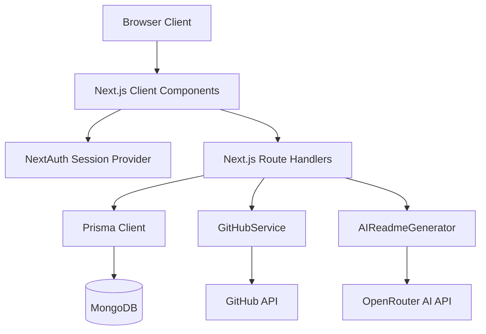

# PROJECT_FULL_ANALYSIS: Codebase & Architectural Analysis for FlareGit

This document serves as a complete, definitive knowledge base and reverse-engineering audit for the **FlareGit** project. It is structured to provide deep project context for both senior developers and LLMs.

---

## 1. Project Overview

* **Project Name:** FlareGit
* **Framework / Project Type:** Full-Stack Web Application built on the Next.js App Router (React framework)
* **Languages Used:** JavaScript (ES6+), HTML5, CSS3 (Tailwind CSS). While TypeScript and Node type definitions are installed as developer dependencies in `package.json`, the entire codebase is written using standard JavaScript (`.js` and `.jsx` extensions).
* **Package Manager:** `npm` (tracked via [package-lock.json](file:///j:/Saas/flaregit/package-lock.json))
* **Database & ORM:** MongoDB served via Prisma ORM
* **Architecture Style:** Monolith (Next.js hosting both frontend pages and serverless API route handlers)

---

## 2. Executive Summary

FlareGit is a full-stack platform designed to help developers enhance their GitHub presence. It allows users to authenticate via GitHub, customize portfolio profiles with custom colors, view repository analytics, and generate professional repository and profile `README.md` files using Google's Gemini 3 Flash model (`google/gemini-3-flash-preview` on OpenRouter).

During our reverse-engineering audit, several critical architectural insights, design patterns, and structural elements were verified:

1. **Dead Features and Blocked UI Components:**
   * **Profile README Generator UI:** The component for generating a user's *Profile* README using AI—[readme-generator.jsx](file:///j:/Saas/flaregit/src/components/readme-generator.jsx)—exists but is **never imported or rendered** in the dashboard page [page.js](file:///j:/Saas/flaregit/src/app/dashboard/page.js). This component contains a naive, regex-based Markdown previewer (`PreviewContent`) that relies on raw `dangerouslySetInnerHTML` regex replacements.
   * **Unused Project Pinner:** The client-side component [repository-list.jsx](file:///j:/Saas/flaregit/src/components/repository-list.jsx) was designed to handle project pinning, but is **never imported or rendered** in the dashboard. Instead, the dashboard implements repository selection and pinning directly inline on the **Featured Projects** tab, rendering `repository-list.jsx` redundant and unused.
   * **Active Profile README Editor:** In contrast to previous mock assumptions, the [readme-editor.jsx](file:///j:/Saas/flaregit/src/components/readme-editor.jsx) component is fully integrated and rendered in the dashboard. It connects directly to the database via API, supporting manual README edits, saving content, and triggering AI profile improvements.
2. **Dynamic Public Profiles:**
   * The public profile page at [page.js](file:///j:/Saas/flaregit/src/app/user/[username]/page.js) is **not mocked**. It dynamically retrieves the developer's profile details via the GET `/api/profiles/[username]` proxy, which fetches remote telemetry from the GitHub API using the user's stored access token and runs data normalization through `buildPortfolioData` (integrating stars, forks, language distributions, and contribution history).
3. **Robust Security Measures:**
   * Raw GitHub OAuth access tokens are kept safe server-side. They are omitted from NextAuth client session serialization and are instead queried directly from the MongoDB `Account` collection using `getGitHubAccessToken`.
   * Enforced repository ownership checks are in place on all write endpoints.
   * The custom profile slug editor features robust validation, checking against alphanumeric formats, length constraints (<30 characters), reserved system keywords, and collisions with other users' githubUsernames and customUrls.
4. **Stripe Billing Integration Absence:**
   * Stripe is included in the `package.json` dependencies and the Prisma Schema exposes subscription statuses and price IDs. However, **no Stripe client, webhooks, or API endpoints exist** in the `src` directory. Stripe integration is currently placeholder configuration only.

---

## 3. Tech Stack Summary

The technical foundation of FlareGit consists of the following tools and services:

| Category | Technology / Package | Location / Configurations |
| :--- | :--- | :--- |
| **Runtime & Framework** | Next.js 14.1.0 (App Router), React 18.2 | [package.json](file:///j:/Saas/flaregit/package-lock.json) |
| **Language** | JavaScript (ES6+ / JSX) | `src/**/*.js`, `src/**/*.jsx` |
| **Database** | MongoDB (Cloud Atlas) | Configured in [schema.prisma](file:///j:/Saas/flaregit/prisma/schema.prisma) |
| **ORM** | Prisma ORM 5.7.1 | [prisma.js](file:///j:/Saas/flaregit/src/lib/prisma.js) / [schema.prisma](file:///j:/Saas/flaregit/prisma/schema.prisma) |
| **Authentication** | NextAuth.js 4.24.5 (GitHub OAuth Provider) | [auth.js](file:///j:/Saas/flaregit/src/lib/auth.js) / `src/app/api/auth/[...nextauth]` |
| **Styling** | Tailwind CSS 3.4.1, Tailwind CSS Typography, CSS Variables | [tailwind.config.mjs](file:///j:/Saas/flaregit/tailwind.config.mjs), [globals.css](file:///j:/Saas/flaregit/src/app/globals.css) |
| **Icons** | Lucide React | Used globally across UI files |
| **Markdown Rendering** | `react-markdown`, `remark-gfm`, `rehype-raw`, `rehype-sanitize` | Used inside [profile-readme-preview.jsx](file:///j:/Saas/flaregit/src/components/profile-readme-preview.jsx) & [repository-readme-generator.jsx](file:///j:/Saas/flaregit/src/components/repository-readme-generator.jsx) |
| **Analytics & Charts** | `recharts`, `react-calendar-heatmap` | Used inside [github-analytics.jsx](file:///j:/Saas/flaregit/src/components/github-analytics.jsx) |
| **AI Integration** | OpenRouter Completions (`google/gemini-3-flash-preview`) | Configured in `.env`, handled in [ai-readme-generator.js](file:///j:/Saas/flaregit/src/lib/ai-readme-generator.js) & [route.js](file:///j:/Saas/flaregit/src/app/api/ai/generate-bio/route.js) |
| **HTTP Queries** | Native `fetch` & Octokit SDK | Used for GitHub API queries |
| **Validation** | Zod 3.22.4 | Declared in `package.json` (Unused in current implementation) |
| **Testing** | Native Node.js Test Runner (`node:test`) | Located in [tests/](file:///j:/Saas/flaregit/tests/) |

---

## 4. Dependency Analysis

### 4.1 Runtime Dependencies

* **Core Next/React:** `next` (14.1.0), `react` (^18.2.0), `react-dom` (^18.2.0).
* **Database & ORM:** `@prisma/client` (^5.7.1), `@auth/prisma-adapter` (^1.0.12) (bridges NextAuth sessions with Prisma).
* **AI & API Clients:** `octokit` (^3.2.1) (Official GitHub SDK), `stripe` (^14.10.0) (*Unused in implementation*).
* **UI Components & Primitives:** `@radix-ui/react-avatar`, `@radix-ui/react-dialog`, `@radix-ui/react-dropdown-menu`, `@radix-ui/react-label`, `@radix-ui/react-select`, `@radix-ui/react-slot`, `@radix-ui/react-tabs`, `@radix-ui/react-toast`.
* **Styling & Animation:** `class-variance-authority` (^0.7.1), `clsx` (^2.1.1), `tailwind-merge` (^2.6.0) (combines tailwind classes safely), `tailwindcss-animate` (^1.0.7), `next-themes` (^0.2.1).
* **Data Visualization & Analytics:** `recharts` (^2.10.4) (renders graphs), `react-calendar-heatmap` (^1.9.0) (renders contribution grid).
* **Markdown Support:** `react-markdown` (^9.0.3), `rehype-raw` (^7.0.0), `rehype-sanitize` (^6.0.0), `remark-breaks` (^4.0.0), `remark-gfm` (^4.0.1) (GitHub Flavored Markdown).
* **Utility Libraries:** `zod` (^3.22.4) (*Present but unused for schema validation*), `lucide-react` (^0.303.0) (Icons).
* **Drag and Drop:** `react-beautiful-dnd` (^13.1.1) (*Unused in current files*).

### 4.2 Development Dependencies

* **TypeScript & Typings:** `typescript` (^5.2.2), `@types/node` (^20.8.2), `@types/react` (^18.2.0), `@types/react-dom` (^18.2.0), `@types/react-beautiful-dnd` (^13.1.8).
* **CSS Tooling:** `autoprefixer` (^10.4.16), `postcss` (^8.4.33), `tailwindcss` (^3.4.1).
* **Linters:** `eslint` (^8.49.0), `eslint-config-next` (14.1.0).
* **Database CLI:** `prisma` (^5.7.1).

### 4.3 Potentially Unused / Suspicious Packages

* `stripe`: Present in `package.json` and schema but completely absent in source code.
* `react-beautiful-dnd`: Present in `package.json` but not imported or used anywhere in `src`.
* `zod`: Installed but not leveraged for runtime parsing or API schema verification.

---

## 5. Architecture Overview



FlareGit follows Next.js client-server boundary separation:

1. **Client / View Layer (`src/app/` and `src/components/`):** React Client Components (annotated with `"use client"`) consume local states, coordinate UI layouts, and make asynchronous `fetch` requests to local API routes.
2. **Server / API Layer (`src/app/api/`):** Next.js Route Handlers authenticate calls using `getServerSession(authOptions)`. They retrieve GitHub access tokens stored in user sessions and instantiate service classes to perform external tasks.
3. **Service Layer (`src/lib/`):**
   * [github.js](file:///j:/Saas/flaregit/src/lib/github.js) wraps `Octokit` commands for fetching/writing to GitHub.
   * [github-profile-analyzer.js](file:///j:/Saas/flaregit/src/lib/github-profile-analyzer.js) aggregates and processes raw repository telemetry, computing metrics like developer specializations, skills, and activity levels.
   * [ai-readme-generator.js](file:///j:/Saas/flaregit/src/lib/ai-readme-generator.js) drafts, formats, and structures markdown text via API calls to OpenRouter.
4. **Data Access Layer:** MongoDB is queried/updated using the Prisma ORM Client initialized in [prisma.js](file:///j:/Saas/flaregit/src/lib/prisma.js).

---

## 6. Folder and File Structure Breakdown

### 6.1 Root Directory

* `prisma/` - Contains [schema.prisma](file:///j:/Saas/flaregit/prisma/schema.prisma) defining MongoDB collections.
* `public/` - Holds static SVGs and media used by Next.js templates.
* `src/` - Core application code.
* `.env` - Environment configurations (API endpoints, credentials, DB URIs).
* `components.json` - Configuration setting up Shadcn UI component locations.
* `next.config.mjs` - Next.js configuration module.
* `cleanup.js` - Utility script to delete deprecated repository routes.

### 6.2 Source Directory (`src/`)

```
src/
├── app/                  # Next.js Pages & Route Handlers
│   ├── api/              # API Endpoints
│   │   ├── ai/           # AI Generation proxies
│   │   ├── auth/         # NextAuth path (JWT configuration)
│   │   ├── github/       # GitHub API proxy routes
│   │   ├── profile/      # Authenticated user profile routes
│   │   └── profiles/     # Public profile routes
│   ├── auth/             # Custom Auth UI (Signin & Error screens)
│   ├── dashboard/        # Main User Panel Dashboard screen
│   ├── privacy/          # Privacy Policy Page
│   ├── terms/            # Terms of Service Page
│   ├── user/             # Public portfolio route: /user/[username]
│   ├── [username]/       # Root portfolio alias (delegates to /user/[username])
│   ├── globals.css       # Standard styling definitions
│   ├── layout.js         # Root layout configuring providers
│   └── page.js           # Public landing page
├── components/           # React Components
│   ├── ui/               # Shadcn styled primitive widgets
│   ├── nav.jsx           # Global header navigation
│   ├── github-analytics.jsx# Charts and contribution calendar
│   ├── profile-readme-preview.jsx # Markdown sanitizing viewer
│   ├── readme-generator.jsx# Profile README generation panel (Unused / dead code)
│   ├── readme-editor.jsx # Profile README editor panel (Active)
│   ├── repository-list.jsx# Repository highlight toggles (Unused / dead code)
│   ├── repository-readme-generator.jsx # Repo README generation UI
│   ├── repository-selector.jsx # Modal selection of repos
│   ├── theme-preview.jsx # Live custom theme visual preview card
│   ├── theme-provider.jsx# next-themes dark mode wrapper
│   └── auth-provider.jsx # next-auth SessionProvider wrapper
├── hooks/                # Custom React hooks (contains use-toast.js)
└── lib/                  # Services, database connectors, and utilities
```

---

## 7. Product Purpose and Problem Solved

FlareGit addresses key problems in the developer job market and portfolio ecosystem:

* **Elevating GitHub Profiles:** Writing high-quality, engaging GitHub Profile `README.md` files is tedious. FlareGit automates this using an AI agent that scans the developer's language history, repository sizes, commit counts, and topics, turning them into a clean, badge-heavy markdown landing page.
* **Creating Instant Portfolios:** Instead of configuring, building, and hosting a custom portfolio site, FlareGit generates a public portfolio link (e.g. `flaregit.com/username` or custom aliases) backed by the developer's real-time GitHub telemetry.
* **Automating Project Documentation:** Generating readme files for codebases is a repetitive developer task. FlareGit parses repository structures and files, writing structured READMEs that are ready to commit back to GitHub in a single click.

---

## 8. User Roles and Primary Workflows

### 8.1 Public Guest / Recruiter

* **Goal:** Review a developer's skills and check their GitHub credentials.
* **Primary Workflow:**
  1. Accesses `http://localhost:3000/user/[username]` (public URL) or `http://localhost:3000/[username]` (direct alias).
  2. Views the developer's bio, location, company, and social links.
  3. Inspects developer statistics, languages, and custom project showcases.
  4. Reads the developer's generated/enhanced profile README.

### 8.2 Registered Developer

* **Goal:** Set up a portfolio, design custom themes, and generate READMEs.
* **Primary Workflow:**
  1. Signs in via GitHub OAuth, granting repo scopes.
  2. Accesses the [Dashboard](file:///j:/Saas/flaregit/src/app/dashboard/page.js) where GitHub information is fetched automatically.
  3. Updates contact details (Twitter, LinkedIn, Personal Site) and inputs a custom portfolio URL slug.
  4. Triggers AI Professional Bio Generation from the profile tab.
  5. Navigates to the **Profile README** tab to improve their profile README with AI or edit it manually, saving it directly to FlareGit database or committing it back to GitHub.
  6. Pins selected projects on the **Featured Projects** tab.
  7. Selects a repository via dialog on the **Repositories** tab, triggering AI generation of an enhanced project `README.md`.
  8. Reviews the draft, makes manual adjustments, and clicks "Save to GitHub" to push the update directly to the remote repository.
  9. Navigates to Theme Customization to pick primary, text, and card background colors for their public FlareGit page.

---

## 9. Full Feature Inventory

| Feature Area | Component / Endpoint | Target Model | Status |
| :--- | :--- | :--- | :--- |
| **GitHub Login** | NextAuth OAuth | N/A | **Complete** |
| **Repository README Generation** | [repository-readme-generator.jsx](file:///j:/Saas/flaregit/src/components/repository-readme-generator.jsx) | `google/gemini-3-flash-preview` | **Complete** |
| **Push README to GitHub** | `POST /api/github/repositories/[username]/[repo]/update-readme` | N/A | **Complete** |
| **GitHub Stats Analytics Charts** | [github-analytics.jsx](file:///j:/Saas/flaregit/src/components/github-analytics.jsx) | N/A | **Complete** |
| **Profile Theme Customizer** | `PUT /api/profile/[userId]` | N/A | **Complete** (With contrast checks) |
| **Profile URL Customization** | `PUT /api/profile/[userId]` | N/A | **Complete** (With collision checks) |
| **Public Portfolio Page** | [ProfilePage](file:///j:/Saas/flaregit/src/app/user/[username]/page.js) | N/A | **Complete** (Retrieves dynamic telemetry) |
| **AI Professional Bio Gen** | `POST /api/ai/generate-bio` | `google/gemini-3-flash-preview` | **Complete** |
| **Profile README Editor** | [readme-editor.jsx](file:///j:/Saas/flaregit/src/components/readme-editor.jsx) | N/A | **Complete** (Linked to database) |
| **Profile README Generation** | `POST /api/github/generate-readme` | `google/gemini-3-flash-preview` | **Complete** |
| **Featured Projects Selector** | [dashboard/page.js](file:///j:/Saas/flaregit/src/app/dashboard/page.js) | N/A | **Complete** (Inline selector) |
| **Stripe Subscriptions** | `Subscription` Model | N/A | **Placeholder / Missing** (no integration code in src) |

---

## 10. Pages / Routes / Screens Breakdown

### 10.1 Public Landing Page (`/`)

* **File:** [page.js](file:///j:/Saas/flaregit/src/app/page.js)
* **Auth Requirement:** None
* **Description:** Marketing interface showcasing FlareGit capabilities (Custom Themes, Portfolios, Analytics) with a call-to-action button linking to login page.

### 10.2 Custom SignIn Page (`/auth/signin`)

* **File:** [page.js](file:///j:/Saas/flaregit/src/app/auth/signin/page.js)
* **Auth Requirement:** None
* **Description:** Renders error messages if OAuth fail conditions arise. Displays a single button to execute NextAuth's `signIn("github")`.

### 10.3 Auth Error Page (`/auth/error`)

* **File:** [page.js](file:///j:/Saas/flaregit/src/app/auth/error/page.js)
* **Auth Requirement:** None
* **Description:** Displays friendly warning labels based on URL error tags (e.g., "Configuration", "AccessDenied", "Verification").

### 10.4 Dashboard (`/dashboard`)

* **File:** [page.js](file:///j:/Saas/flaregit/src/app/dashboard/page.js)
* **Auth Requirement:** Authenticated (Server-side middleware intercepts and redirects unauthenticated users to `/auth/signin`).
* **Description:** Primary developer workspace. Organised via Tabs:
  * **Profile:** Contains read-only GitHub account items, AI Bio generation panel, and forms to update user metadata (LinkedIn, Twitter, website, location, and custom URL).
  * **Repositories:** Hosts the repository selector and AI README generation wizard.
  * **Profile README:** Hosts the editor to refine or AI-generate the developer's main profile README.
  * **Featured Projects:** Allows the user to select and toggle which repositories are featured on their portfolio.
  * **Analytics:** Features graphs from Recharts (trends, language ratios) and heatmaps of git commits.
  * **Theme Settings:** Holds the primary/text/card custom color pickers, accessibility contrast ratio indicators, and visual theme preview card.

### 10.5 Public Profile Page (`/user/[username]` & `/[username]`)

* **File:** [page.js](file:///j:/Saas/flaregit/src/app/user/%5Busername%5D/page.js) and [page.js](file:///j:/Saas/flaregit/src/app/%5Busername%5D/page.js)
* **Auth Requirement:** None (Public)
* **Description:** Loads profile schema metrics matching `githubUsername` or `customUrl`. Colors are loaded dynamically from the custom theme stored in database. Renders dynamic GitHub statistics, language charts, featured projects, and the profile README preview.

### 10.6 Legal Pages (`/privacy` & `/terms`)

* **Files:** [privacy/page.js](file:///j:/Saas/flaregit/src/app/privacy/page.js) and [terms/page.js](file:///j:/Saas/flaregit/src/app/terms/page.js)
* **Auth Requirement:** None (Public)
* **Description:** Standard terms of service and privacy statement guidelines.

---

## 11. API / Backend Breakdown

All Route Handlers use Next.js `NextResponse` helpers and require authentication (except the public profile loader).

### 11.1 Auth API (`/api/auth/[...nextauth]`)

* **File:** [route.js](file:///j:/Saas/flaregit/src/app/api/auth/%5B...nextauth%5D/route.js)
* **Methods:** `GET`, `POST`
* **Description:** Directs incoming requests to the NextAuth handler config.

### 11.2 Public Profile Fetcher (`/api/profiles/[username]`)

* **File:** [route.js](file:///j:/Saas/flaregit/src/app/api/profiles/%5Busername%5D/route.js)
* **Methods:** `GET`
* **Description:** Publicly fetches user profile parameters by querying either `githubUsername` or `customUrl`. Enriches database values with remote GitHub telemetry (repositories, languages, stars, and contribution trends).

### 11.3 AI Bio Generator (`/api/ai/generate-bio`)

* **File:** [route.js](file:///j:/Saas/flaregit/src/app/api/ai/generate-bio/route.js)
* **Methods:** `POST`
* **Description:** Authenticated endpoint. Analyzes user telemetry (location, stars, specialization, languages) and calls the Gemini model over OpenRouter to generate a professional biography.

### 11.4 AI Repository README Generator (`/api/ai/generate-repo-readme`)

* **File:** [route.js](file:///j:/Saas/flaregit/src/app/api/ai/generate-repo-readme/route.js)
* **Methods:** `POST`
* **Description:** Authenticated endpoint. Requests body containing `repository`, `existingReadme`, and `files` tree. Forwards structure to Gemini model over OpenRouter and returns generated markdown.

### 11.5 AI Profile README Generator (`/api/github/generate-readme`)

* **File:** [route.js](file:///j:/Saas/flaregit/src/app/api/github/generate-readme/route.js)
* **Methods:** `GET`, `POST`
* **Description:**
  * `POST`: Analyzes authenticated developer profile, runs query aggregates via `GitHubProfileAnalyzer`, forwards metadata to `AIReadmeGenerator`, and returns generated raw text.
  * `GET`: Retrieves saved `generatedReadme` content and update timestamp from database.

### 11.6 Repository List (`/api/github/repositories/[username]`)

* **File:** [route.js](file:///j:/Saas/flaregit/src/app/api/github/repositories/%5Busername%5D/route.js)
* **Methods:** `GET`
* **Description:** Retrieves up to 100 repositories owned by user from GitHub API.

### 11.7 Repo README Fetcher (`/api/github/repositories/[username]/[repo]/readme`)

* **File:** [route.js](file:///j:/Saas/flaregit/src/app/api/github/repositories/%5Busername%5D/%5Brepo%5D/readme/route.js)
* **Methods:** `GET`
* **Description:** Fetches current repository `README.md` and repository directory structure tree.

### 11.8 Push README to GitHub (`/api/github/repositories/[username]/[repo]/update-readme`)

* **File:** [route.js](file:///j:/Saas/flaregit/src/app/api/github/repositories/%5Busername%5D/%5Brepo%5D/update-readme/route.js)
* **Methods:** `POST`
* **Description:** Commits generated README markdown back to owner's GitHub repository. Enforces repository ownership checks.

### 11.9 User Profile Editor (`/api/profile/[userId]`)

* **File:** [route.js](file:///j:/Saas/flaregit/src/app/api/profile/%5BuserId%5D/route.js)
* **Methods:** `GET`, `PUT`
* **Description:**
  * `GET`: Restricts retrieval to authorized session user. Returns profile details.
  * `PUT`: Updates user's profile and custom styling values. Enforces collision checks and reserved word blocks on custom URLs.

### 11.10 GitHub Telemetry Proxies

* **`/api/github/contributions/[username]`** (GET) -> Retrieves contribution timeline metrics.
* **`/api/github/languages/[username]`** (GET) -> Retrieves total byte percentages of repository language distributions.
* **`/api/github/stats/[username]`** (GET) -> Counts total stargazers and forks.
* **`/api/github/trends/[username]`** (GET) -> Compiles 12-month timeline contributions.
* **`/api/github/traffic/[username]/[repo]`** (GET) -> Proxies repo clone and view statistics.

---

## 12. Database and Data Model Breakdown

Prisma manages relationships and structures on MongoDB. ObjectIDs map to string types.

```
  +------------------+         +------------------+
  |      User        |         |     Account      |
  +------------------+         +------------------+
  | id (PK)          |1       *| id (PK)          |
  | name             |<------->| userId (FK)      |
  | email (Unique)   |         | provider         |
  | image            |         | access_token     |
  | createdAt        |         +------------------+
  +--------+---------+
           | 1
           |
           | 1
  +--------v---------+         +------------------+
  |     Profile      |         |   Testimonial    |
  +------------------+         +------------------+
  | id (PK)          |1       *| id (PK)          |
  | userId (FK)      |<------->| profileId (FK)   |
  | githubUsername   |         | authorName       |
  | customUrl        |         | content          |
  | bio, location    |         +------------------+
  | customizations   |
  | customTheme      |         +------------------+
  | generatedReadme  |         |   Subscription   |
  +------------------+         +------------------+
           | 1                 | id (PK)          |
           +------------------>| userId (FK)      |
                              1| status, plan     |
                               +------------------+
```

### 12.1 User Model

* **Core Role:** Identity entity used for user authentication.
* **Key Fields:** `name`, `email` (unique index), `emailVerified`, `image`.
* **Relations:** One-to-many with `Account` (allows social login linking), one-to-many with `Session`, one-to-one with `Profile`, one-to-one with `Subscription`.

### 12.2 Account Model

* **Core Role:** Manages social identity tokens linked to a user.
* **Key Fields:** `provider`, `providerAccountId` (unique index compound), `access_token` (GitHub OAuth access token).
* **Cascade Delete:** Deleting user drops linked Account rows.

### 12.3 Profile Model

* **Core Role:** Stores user-customized information, styling values, and AI assets.
* **Key Fields:**
  * `githubUsername`: Used for Octokit API queries.
  * `customUrl` (unique index): Custom portfolio path alias.
  * `customTheme` (Json): Stores primary, text, background, card, and heading colors.
  * `skills` (String array): Extracted GitHub languages and topics.
  * `featuredProjects` (Json): Projects pinned by user.
  * `generatedReadme`: Stored output of AI profile README text.
* **Relations:** Linked 1-to-1 with `User`. One-to-many with `Testimonial` (unused in application code).

### 12.4 Testimonial Model

* **Core Role:** Recommendations or reviews posted to portfolio profiles.
* **Key Fields:** `authorName`, `authorTitle`, `content`, `rating`, `isVerified`.
* **Relations:** Linked to a parent `Profile` (unused in application code).

### 12.5 Subscription Model

* **Core Role:** Tracks commercial payment tiers.
* **Key Fields:** `stripeCustomerId`, `stripeSubscriptionId`, `stripePriceId`, `status` ("active", "canceled", "past_due"), `plan` ("free", "pro", "enterprise").
* **Relations:** Linked 1-to-1 with `User`.

---

## 13. Authentication and Authorization

* **Auth Provider:** GitHub OAuth
* **Scopes Configured:** `read:user user:email repo` in [auth.js](file:///j:/Saas/flaregit/src/lib/auth.js#L14).
  * *Security Note:* The `repo` scope requests read/write access to both public and private repositories. This is necessary to query file structures and push files back to GitHub.
* **Session Strategy:** JSON Web Token (JWT) with 30-day expiration.
* **Auth Callbacks:**
  * `jwt()`: Intercepts the OAuth login payload, saving the GitHub API `accessToken`, target `provider`, login `username`, and database user `id` in the encoded token.
  * `session()`: Exposes variables (`user.id`, `user.username`, `user.bio`) directly to client components via `useSession()`. Access tokens are omitted to prevent browser exposure.
  * `signIn()`: Executes on successful GitHub redirect. It searches for existing emails:
    * If absent, it creates a new `User`, maps a new `Profile` with `githubUsername`, and instantiates `Account`.
    * If present but lacking GitHub link records, it updates references and creates the connection. It also updates the profile with the latest GitHub biography and avatar updates.

---

## 14. State Management and Data Flow

### 14.1 Authentication State

* Global state is managed by the NextAuth `SessionProvider` imported in [auth-provider.jsx](file:///j:/Saas/flaregit/src/components/auth-provider.jsx) and wrapped inside [layout.js](file:///j:/Saas/flaregit/src/app/layout.js).
* Components retrieve current session credentials using `const { data: session, status } = useSession()`.

### 14.2 Local Client State

* React `useState` hooks manage form updates, active navigation paths, theme colors, modal dialog configurations, and pending loader flags.
* In [repository-readme-generator.jsx](file:///j:/Saas/flaregit/src/components/repository-readme-generator.jsx), local hooks track whether the user is viewing the markdown draft or the parsed preview layout.

### 14.3 Server-Client Data Sync

* Next.js pages query API endpoints using native `fetch`.
* *Architecture Note:* The developer dependencies include `@tanstack/react-query`, but it is **not used** in the application components. Data fetching relies on native `useEffect` fetch logic.

---

## 15. UI / Component System

FlareGit features a responsive design layout styled with Tailwind CSS and Radix UI primitives:

* **Tailwind CSS Configurations:** Configured in [tailwind.config.mjs](file:///j:/Saas/flaregit/tailwind.config.mjs). It implements customized animation keyframes (`accordion-down`, `accordion-up`), border radius variables, and Tailwind Typography presets for rendering markdown structures.
* **Global Navigation:** The [MainNav](file:///j:/Saas/flaregit/src/components/nav.jsx) header sits on top of all pages, featuring active page color changes, theme toggle commands, and dropdown option lists for logged-in sessions. Includes a hamburger-triggered mobile drawer.
* **Accessibility Contrast Ratio Indicators:** Real-time luminance calculations in the Theme Customizer block saving profiles if text-to-background contrast falls below `2.5:1`.
* **Theme Preview:** [ThemePreview](file:///j:/Saas/flaregit/src/components/theme-preview.jsx) renders a mockup preview card reflecting user-selected hex colors.

---

## 16. External Integrations

### 16.1 GitHub REST & GraphQL APIs (via Octokit SDK)

* Implemented in [GitHubService](file:///j:/Saas/flaregit/src/lib/github.js).
* It aggregates repository list data and uses GraphQL queries to fetch commit calendars and weekly contributions. It also lists repository files recursively (checking `main` then `master` branches) and pushes modified README files back to GitHub.

### 16.2 OpenRouter AI Completions

* Implemented in [AIReadmeGenerator](file:///j:/Saas/flaregit/src/lib/ai-readme-generator.js) and route handlers.
* It posts developer data packages to the OpenRouter endpoint, targeting the model `google/gemini-3-flash-preview`.
* System prompts configure strict formatting guidelines (HTML centers, shields.io badges, markdown headers, and blockquotes).

### 16.3 Stripe (Incomplete / Dead Code)

* Stripe is listed in configuration files, but there is **no logic implementing billing checkout flows, pricing details, or webhook validation**.

---

## 17. Config / Environment / Build / Deployment

### 17.1 Environment Variables

These configurations must be defined in the `.env` file for the app to function properly:

* `DATABASE_URL`: MongoDB connection URI.
* `NEXTAUTH_URL`: Canonical site host URL (e.g. `http://localhost:3000`).
* `NEXTAUTH_SECRET`: String hash used by NextAuth to sign JWT session cookies.
* `GITHUB_ID` & `GITHUB_SECRET`: Application OAuth credentials registered in developer settings.
* `AI_API_ENDPOINT`: Set to OpenRouter chat completions URL.
* `AI_API_KEY`: OpenRouter API key.
* `STRIPE_SECRET_KEY`, `STRIPE_WEBHOOK_SECRET`, `STRIPE_PRICE_ID_PRO`, `STRIPE_PRICE_ID_ENTERPRISE`: Stripe subscription configuration settings (*Unused*).

### 17.2 Development & Build Process

* **Start Dev Server:** `npm run dev` (uses Next.js turbopack mode: `next dev --turbo`).
* **Production Build:** `npm run build` (transpiles pages, resolves routes, compiles Next.js bundles).
* **Local Production Start:** `npm run start`.
* **Prisma Code Generation:** Run `prisma generate` (triggered automatically after package installation via `postinstall` script in `package.json`).
* **Running Tests:** Executed using native Node.js test runner (e.g., `node --test tests/*.test.mjs`).

---

## 18. Important File-by-File Notes

### 18.1 Services & Libs (`src/lib/`)

* **[auth.js](file:///j:/Saas/flaregit/src/lib/auth.js):** Configures NextAuth. Customizes database sign-in callbacks to automatically synchronize GitHub account changes (bio, name, avatar) with MongoDB. Exports `getGitHubAccessToken` to safely query credentials server-side.
* **[github.js](file:///j:/Saas/flaregit/src/lib/github.js):** Wraps raw Octokit SDK endpoints. It uses GraphQL to query contributions and filters out binary and large files (>1MB) to construct a file tree overview. It also manages file updates to GitHub.
* **[github-profile-analyzer.js](file:///j:/Saas/flaregit/src/lib/github-profile-analyzer.js):** Aggregates user metrics (language ratios, stargazers, forks). Evaluates developers as "Frontend", "Backend", "Mobile", "DevOps", or "Data Science" specialized based on language usage percentages and repo topics.
* **[ai-readme-generator.js](file:///j:/Saas/flaregit/src/lib/ai-readme-generator.js):** Customizes prompt generation templates. Regulates output layout and handles response cleaning. Requests `google/gemini-3-flash-preview`.
* **[portfolio-data.mjs](file:///j:/Saas/flaregit/src/lib/portfolio-data.mjs):** Normalizes telemetry data and featured projects, combining database details and dynamic GitHub API responses for the public profile page.

### 18.2 UI Components (`src/components/`)

* **[nav.jsx](file:///j:/Saas/flaregit/src/components/nav.jsx):** Implements header nav bar, system dark-mode toggling, mobile hamburger navigation drawer, and user sessions. Links to the profile using the correct `/user/[username]` path.
* **[github-analytics.jsx](file:///j:/Saas/flaregit/src/components/github-analytics.jsx):** Integrates Recharts graphs and contributions calendar heatmap charts.
* **[readme-generator.jsx](file:///j:/Saas/flaregit/src/components/readme-generator.jsx):** Implements profile README generation widgets.
  * > [!NOTE]
  * > This component is unused and never rendered in the dashboard. It contains the naive regex-to-html previewer.
* **[readme-editor.jsx](file:///j:/Saas/flaregit/src/components/readme-editor.jsx):** Active dashboard panel for manual and AI-assisted profile README editing. Uses `ProfileReadmePreview` to render clean markdown.
* **[repository-list.jsx](file:///j:/Saas/flaregit/src/components/repository-list.jsx):** Unused project pinning component.
* **[repository-readme-generator.jsx](file:///j:/Saas/flaregit/src/components/repository-readme-generator.jsx):** The core active repository markdown generation component. It includes visual tab sections for editing and previewing code.
* **[profile-readme-preview.jsx](file:///j:/Saas/flaregit/src/components/profile-readme-preview.jsx):** Renders sanitised profile README markdown using `ReactMarkdown` with `remark-gfm` and `rehype-raw`/`rehype-sanitize`.

### 18.3 Root Pages (`src/app/`)

* **[page.js](file:///j:/Saas/flaregit/src/app/page.js):** Public landing page layout.
* **[page.js](file:///j:/Saas/flaregit/src/app/dashboard/page.js):** Core dashboard component coordinating custom theme pickers, contrast guards, API sync logic, and Tab controls.
* **[page.js](file:///j:/Saas/flaregit/src/app/user/[username]/page.js):** Public developer portfolio viewer page. Integrates dynamic telemetry parameters and custom color styles.
* **[page.js](file:///j:/Saas/flaregit/src/app/[username]/page.js):** Direct root-level folder route redirecting traffic to `/user/[username]`.

---

## 19. Strengths of the Current Codebase

* **Clean Architecture Separation:** Logic is neatly divided into isolated layers. External calls (GitHub API and AI endpoints) are kept out of visual layout code and separated into discrete service files, simplifying maintenance.
* **Robust Access Token Security:** NextAuth session serialization does not expose write-scope GitHub tokens to the client browser. All GitHub telemetry fetches retrieve tokens directly from MongoDB on the server.
* **Validation & Collision Guards:** Modifying user profiles enforces alphanumeric characters, hyphens, and underscores, restricts URL slug lengths (<30 characters), blocks reserved words (e.g. `dashboard`, `auth`, `api`, `admin`), and protects against customUrl/githubUsername collision hijacking.
* **Accessibility Theme Safeguards:** Real-time relative luminance calculation blocks saving customized portfolio themes if text contrast ratio drops below `2.5:1`, preventing unreadable profile screens.
* **Visual Polish:** Incorporates shadcn/ui styles, smooth CSS transitions, interactive hover settings, responsive layouts, a hamburger mobile navigation drawer, and automatic dark/light theme switching.
* **Comprehensive Analytics:** Integrates Recharts and calendar heatmaps, providing a rich, visual representation of GitHub activity.

---

## 20. Weaknesses / Risks / Tech Debt

* **Dead Code and Unused Imports:** The dashboard page [page.js](file:///j:/Saas/flaregit/src/app/dashboard/page.js) imports several unused components:
  ```javascript
  import { ReadmeEditor } from "@/components/readme-editor";
  import { RepositoryReadmeGenerator } from "@/components/repository-readme-generator";
  ```
  And has unused files like `src/components/readme-generator.jsx` and `src/components/repository-list.jsx` sitting in the codebase, bloating the repository size.
* **Fragile Regex Converter in Dead Code:** The unused `readme-generator.jsx` implements its own custom Markdown-to-HTML parser using primitive regular expressions. If this component is ever wired back up without refactoring, it will introduce formatting bugs and potential security vulnerabilities.
* **No Automated Test Coverage for API Controllers:** While the service layer features unit tests (`node:test`) under `tests/`, there are no integration tests verifying route handler logic, middleware redirects, or session-handling edge cases.

---

## 21. Incomplete / Unclear / Inferred Areas

* **Stripe Subscriptions:** Stripe configurations exist in the schema and environment settings, but no payment gateway checkout endpoints, customer portal links, webhooks, or plans are implemented in the code.
* **Unexposed Profile README Customization Options:** The `generate-readme` route supports full custom sections and widgets in the backend, but the dashboard editor (`readme-editor.jsx`) only exposes three simplified predefined styles ("professional", "bold", "minimal").
* **No Rate Limiting:** Although the `.env` variables list rate-limiting options, no middleware or API interceptor implements rate-limiting blocks, exposing endpoints to DDoS risks.

---

## 22. Glossary of Important Internal Terms

* **`githubUsername`**: The user's official GitHub handle, used to pull API metrics.
* **`customUrl`**: A custom alias set by the user (e.g. `flaregit.com/alias`), allowing them to share their portfolio page with a personalized URL.
* **`customTheme`**: A database JSON field storing a user's customized portfolio layout colors (text, background, accent, etc.).
* **`featuredProjects`**: A JSON list in the database containing user-pinned repositories to showcase on their public profile.
* **`generatedReadme`**: Stored markdown text generated by AI for the user's main profile.

---

## 23. Concise “Explain This Project to Another LLM” Summary

```
[PROJECT CONTEXT: FlareGit]
- Stack: Next.js 14.1.0 (App Router), Node (JS only), MongoDB via Prisma ORM, Tailwind CSS, Radix UI, Native Node.js Test Runner.
- Core Purpose: A developer portfolio builder and AI README generator. It uses GitHub OAuth to authorize access, analyzes profile data via Octokit (REST + GraphQL), and calls OpenRouter (Gemini 3 Flash) to generate markdown repository/profile READMEs and professional bios.
- Key Services:
  - `src/lib/github.js`: Handles GitHub repository lists, file trees, and README commits.
  - `src/lib/github-profile-analyzer.js`: Processes telemetry to identify skills, specializations, and activity levels.
  - `src/lib/ai-readme-generator.js`: Builds structured prompts and processes output markdown.
  - `src/lib/auth.js`: Manages NextAuth flows, secures access tokens by keeping them server-side, and retrieves them directly from MongoDB via `getGitHubAccessToken`.
- Security & Guards:
  - Access Token Security: Raw write tokens are omitted from client-side sessions.
  - Slug Validation: customUrl edits check for valid slugs, length, collisions, and reserved keywords.
  - Contrast Guardrails: Themes require text-to-background contrast >= 2.5:1.
  - Markdown Safety: profile-readme-preview.jsx sanitizes markdown using rehype-sanitize to block XSS.
- Unused/Dead Code:
  - `src/components/readme-generator.jsx`: Contains unused profile README generation code with a fragile regex HTML parser.
  - `src/components/repository-list.jsx`: Unused repository listing widget.
  - Stripe integration is completely absent in src.
```
